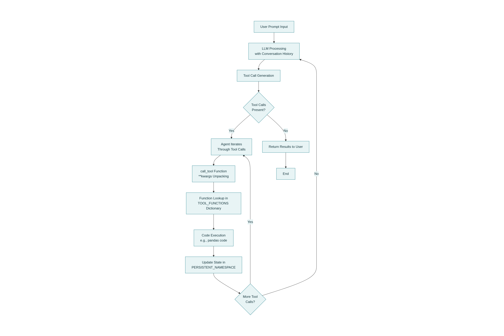

# GPU-Accelerated Data Science Agent

Building an AI-powered data science agent with GPU acceleration.

Usually data science tasks can be time-consuming, especially when working with large datasets and writing python code for data frame operations and data analysis. By leveraging NVIDIA's cuDF library for GPU acceleration and integrating it with an AI agent, we can significantly speed up data processing and analysis.

## Features
-   Enable GPU acceleration with NVIDIA cuDF in just 2 lines of code
-   Build an AI agent that writes Python code from natural language
-   Perform interactive data analysis through conversational AI
-   Execute large tabular data operations with GPU acceleration

## GPU Acceleration in Just 2 Lines of Code
### The Setup
Traditional pandas operations run on CPU. With NVIDIA's cudf.pandas, you get massive speedups without changing your code.

~~~
import cudf.pandas
cudf.pandas.install()
~~~

After these two lines, your pandas code automatically runs on GPU when beneficial.

## NVIDIA Nemotron: The Model Behind the Agent
The DataScienceAgent uses NVIDIA Nemotron-9B-v2 (nvidia_NVIDIA-Nemotron-Nano-9B-v2-Q8_0.gguf), a language model optimized for:

- Function calling and structured output
- Python code generation and data analysis tasks
- Efficiency - runs locally on consumer GPUs
- Accuracy - competitive with larger models on specific tasks

## How the DataScience Agent Works

It is an autonomous data science agent that can write and execute pandas code. The agent maintains conversation state and can handle multiple prompts   in sequence, building on previous context.

~~~~~
System_prompt = "/no_think " \
        "You are a data science expert. " \
        "Write complete, executable Python code or call provided tools. " \
        "IMPORTANT: Do NOT assume variables exist unless shown in the execution environment state. " \
        "When asked to 'read' or 'load' a file, write the full code including 'import pandas as pd' and 'pd.read_csv()'. " \
        "Always use GPU acceleration (pandas will automatically use GPU). " \
        "Use print() to show results. " \
        "Preserve exact case of data values. Don't change 'apple' to 'Apple'. " \
        "Now answer user's request:\n"
~~~~~

available tools to the DataScienceAgent are in this set:
{
    "get_csv_headers","execute_python_code","reset_execution_environment"
}

When user prompts the agent, it processes the request and runs the agentic loop, allowing the LLM to:
        1. Understand the user's request
        2. Call tools to inspect data or execute code
        3. Generate and run pandas code
        4. Return results

agnetic loop will call the call_tool funciton defined in tools.py which is responsible for actually executing the tools requested by the LLM.

It takes a tool_name and arguments, looks up the corresponding function in TOOL_FUNCTIONS, and executes it.

The flow is as follows:

The agent sends the user prompt and conversation history to the LLM.
The LLM returns a response, which may include tool calls (e.g.,execute_python_code).
The agent iterates through these tool calls in the _run_agent_loop method.

For each tool call, it parses the arguments and calls call_tool method as follows:

result = call_tool(tool_name, **arguments)

The ** operator performs dictionary unpacking.

In this context, arguments is a dictionary (e.g., {"code": "print('hello')", "use_gpu": True}).

Using **arguments unpacks that dictionary into keyword arguments, so the call:

python call_tool(tool_name, **arguments) Is exactly equivalent to writing:

python
call_tool(tool_name, code="print('hello')", use_gpu=True)
It allows the code to be dynamic, passing whatever arguments the LLM generated directly to the function without knowing them in advance.

call_tool() function use global PERSISTENT_NAMESPACE dictionary to maintain state across multiple tool calls and user prompts. This allows the agent to build on previous context and data manipulations.

## sample prompts and results

### 1. Prompt with streaming resposne
💬 You: how many rows and columns are there?

### 🤖 Agent:
======================================================================
### USER PROMPT: how many rows and columns are there?
======================================================================

  Streaming response: The DataFrame has 39,717 rows and 111 columns.

[AGENT RESPONSE]
----------------------------------------------------------------------
The DataFrame has 39,717 rows and 111 columns.
----------------------------------------------------------------------

[Agent Response]
The DataFrame has 39,717 rows and 111 columns.

### 2. Prompt with code execution

💬 You: what is the currect column in the dataframe? 

### 🤖 Agent:
======================================================================
### USER PROMPT: what is the currect column in the dataframe? 
======================================================================

  Calling: execute_python_code{"code":"print(df.columns.tolist())"}
  -> Calling tool: execute_python_code
    use_gpu: True
    code:
      print(df.columns.tolist())
{
  "success": true,
  "mode": "gpu_accelerated",
  "execution_time_seconds": 0.0162
}
[Agent Response]
['id', 'member_id', 'loan_amnt', 'funded_amnt', 'funded_amnt_inv', 'term', 'int_rate', 'installment', 'grade', 'sub_grade', 'loan_status']

Original notebook can be found here 

https://www.kaggle.com/code/davisvarkey/gpu-accelerated-data-science-agent/edit
