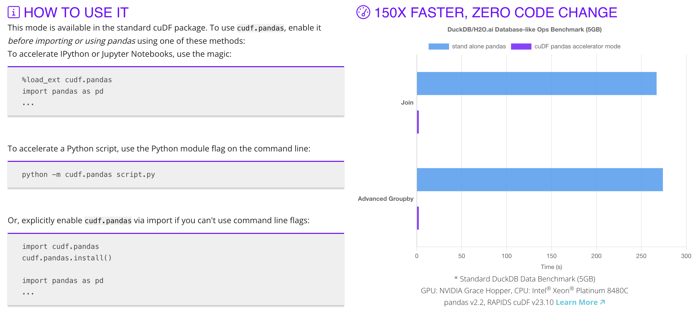
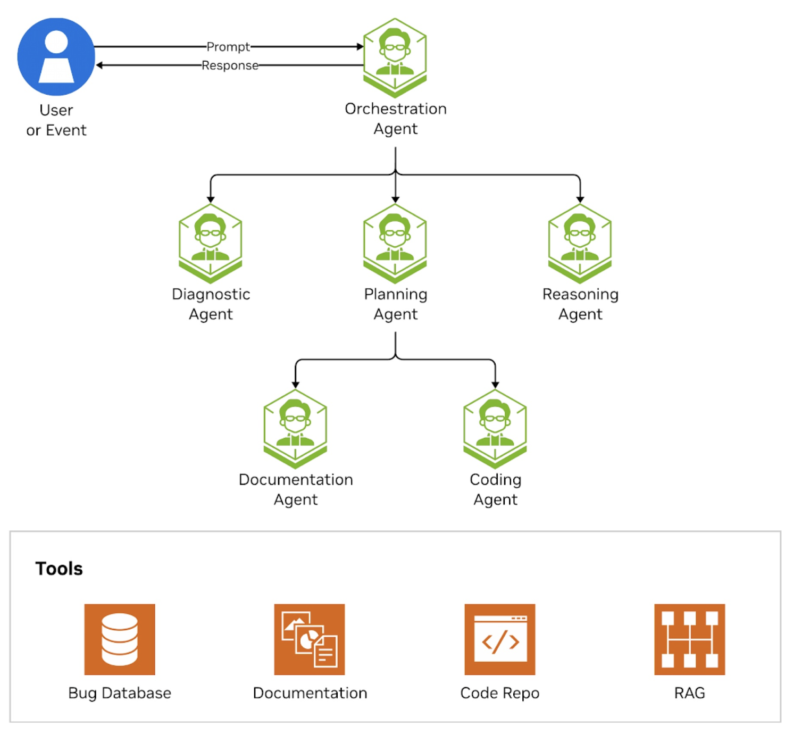

# GPU-Accelerated Data Science Agent

Building an AI-powered data science agent with GPU acceleration.

Usually data science tasks can be time-consuming, especially when working with large datasets and writing python code for data frame operations and data analysis. By leveraging NVIDIA's cuDF library for GPU acceleration and integrating it with an AI agent, we can significantly speed up data processing and analysis.

## Features
-   Enable GPU acceleration with NVIDIA cuDF in just 2 lines of code
-   Build an AI agent that writes Python code from natural language
-   Perform interactive data analysis through conversational AI
-   Execute large tabular data operations with GPU acceleration

## GPU Acceleration in Just 2 Lines of Code
### The Setup
Traditional pandas operations run on CPU. With NVIDIA's cudf.pandas, you get massive speedups without changing your code.

₹
import cudf.pandas
cudf.pandas.install()
₹

After these two lines, your pandas code automatically runs on GPU when beneficial.

